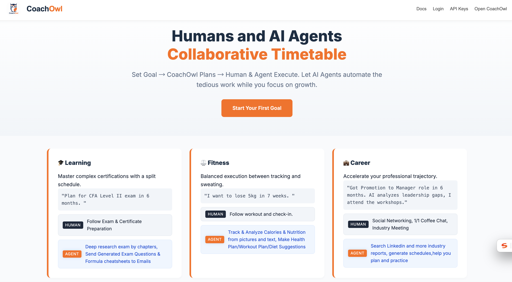
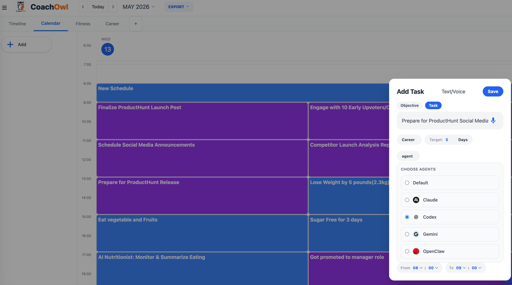
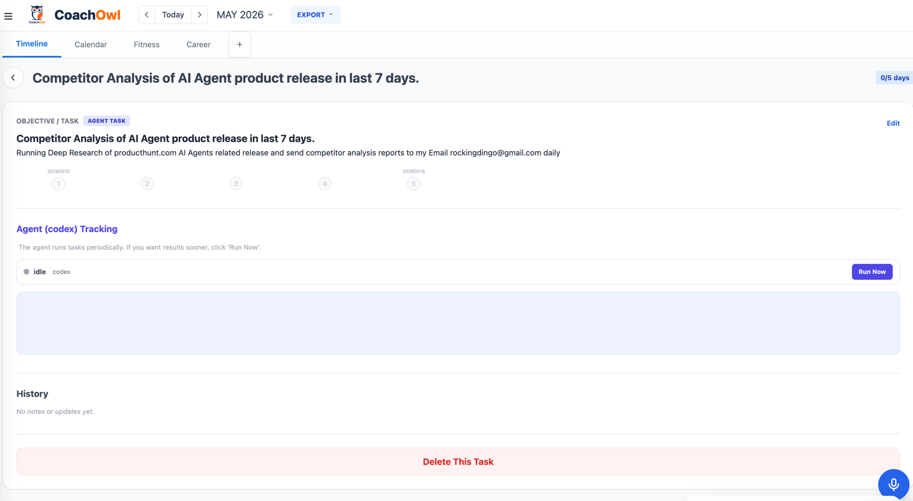
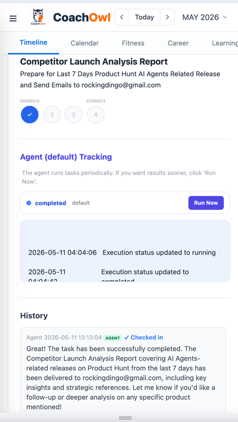
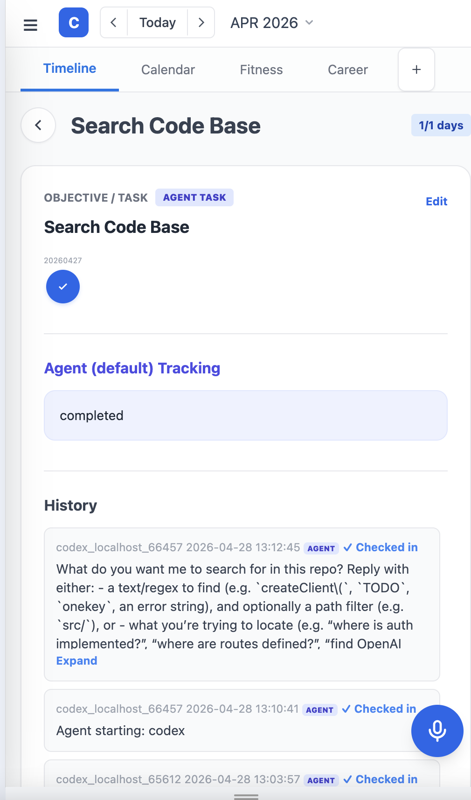
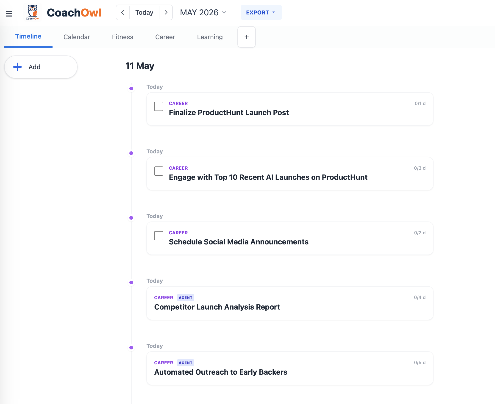
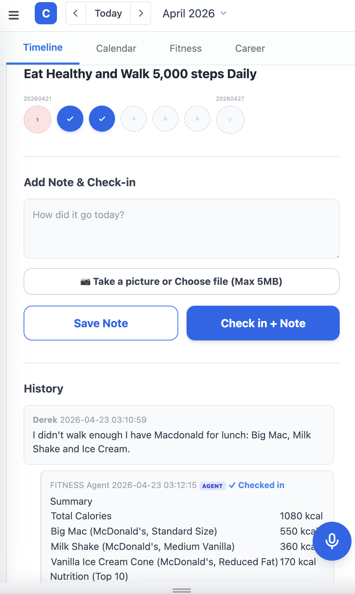

## CoachOwl AI Agent Timetable & Orchestrator
CoachOwl is an open source Humans and AI Agents Collaborative Timetable for shared goal execution and AI Agent Orchestration, where human (yourself) and your 
agents work together to plan, schedule, execute, and achieve real results. It allows you to connect your local Agents (Claude/Codex/Gemini/OpenClaw)
to the AI Agent Orchestration timetable to assign tasks, schedule recursive tasks, and track executions.

AI Coaches in various categories (Fitness, Career, Learning, etc). We need to set goals, let agent and human do some tasks and achieve the goal using a shared online timetable. 

Add Objective -> CoachOwl Plan Tasks -> Human and Agent Execute: Check-ins, Take Picture, Execute Tasks. "Get a new job in 3 months" "Save money” or “Prepare for CFA exams” "Prepare for ProductHunt Release".




**Website**:   
[CoachOwl HomePage](https://coachowl.aiagenta2z.com/index)    
[CoachOwl App](https://coachowl.aiagenta2z.com/)    
[Register & Login](https://www.deepnlp.org/workspace/keys)


**Hosted & Deployed with SubDomains**:    
`https://coachowl.aiagenta2z.com/*`    
[AI Agent A2Z Web](https://www.deepnlp.org/workspace/deploy)    
[Agent Deployment Doc](https://www.deepnlp.org/doc/agent_mcp_deployment)     

## Features

1. Online Timetable & Calendar: CoachOwl Agent has the calendar & timeline features to allows AI Agent to connect, track, assign and schedule tasks for human and AI Agents to collaborative, competible with Google Calendar, Outlook for AI Agents.
2. AI Agent Orchestration:  Humans can better assign repetitive & periodic tasks easily to your personal Agents by scheduling, tracking compared to sending messages. Scenario: Repetitively Sending Emails of competitor analysis of ProductHunt daily for 2 weeks. Anaylyzing food calories for 2 weeks. Prepare for SAT/CFA/GRE exams. 
3. Add a task & objective: You can add task, objective (AI coach will plans several periodic tasks for you and you can always edit task contents.)
4. AI Coaches: AI Coaches with Special Skills assigns tasks to both human and agents, such as Fitness Coach, Relationship Coach, Career Coach, Relationship Coach, 
Fitness Coach: Food Calories Analysis, Image Recognition, Career Coach: Search Indutry info and send briefs to Emails. Prepare for Social Media Anouncement, write Blogs. Learning Coaches
5. Easy Voice Input, Habit Tracking, AI Agent Task Scheduling, Connect to Claude Code, Codex, OpenClaw and more.

### Support Coaches and Agent Tools & Ability

The app is build on Onekey Agent Router APIs for Image processing, Food Calories Searching, Sending Emails, Deep Research Abilities.
You can always extends more skills to use CoachOwl as an AI Agent Orchestrator to assign tasks to your Local Agents (Codex/Claude/Gemini)

| Category | Agent Tools & Features                                                                                                                      |
|---------------|---------------------------------------------------------------------------------------------------------------------------------------------|
| BASE          | `base_search` Deep Research of Google Search Tavily Search APIs, `send_email_with_attachments` Send summary reports to your Email accounts. |
| Fitness       | `analyze_foods_nutrition_workflow`  generate nutritions & calories reports from uploaded images or text input                               |
| Career        | `track_competitor_launches_producthunt` Fetch ProductHunt releases, `job_search` APIs                                                       |
| Learning      | Exam mock question generation, such as `CFA` `SAT`                                                                                          |

| Agents OneKey Gateway | Supported Agents                       |
|-----------------------|----------------------------------------|
| Default               | Default, Server Web Agents on CoachOwl |
| Codex                 | Local Agents, `codex` CLIs             |
| Claude Code           | Local Agents, `claude` CLIs            |
| Gemini                | Local Agents, `gemini` CLIs            |
| OpenClaw              | Local Agents, `openclaw` CLIs          |


#### AI Agent Orchestration Design
See the tables and description in [Doc README.md](docs/README.md)

| Table |
| --- | 
| agent_execution_state | 
| agent_execution_logs | 
| habit_logs | 
| habits | 


## QuickStart

1. Staring the App
Use the Online TimeTable at [Website](https://coachowl.aiagenta2z.com/index) or start the app locally and visit 
Local App at [Local Web App](http://0.0.0.0:7115/)

```shell
git clone https://github.com/AI-Hub-Admin/CoachOwl-Agent-Timetable.git
cd CoachOwl-Agent-Timetable
uvicorn python.src.server:app --host 0.0.0.0 --port 7115
```

### 2. Schedule an agent Task for 5 days

You can schedule a task (single Task) on the timetable for both humans (yourself) or Agents (default and local machine agents)
or an objective (multiple tasks for human and agents). 


Click Add (Input Button) -> Select Task -> Prepare for ProductHunt Social Media Product Release
Target Days: 5 days in streak. 
Mode: Agent, 
Assigned Agent: Default (Running on CoachOwl Server) or Codex on your laptop (Running OneKey Gateway to Fetch Tasks to your Laptop and actually running your personal data and report tasks status). 

CoachOwl Add Task: Competitor Analysis of AI Agent product release in last 7 days.
Edit Content prompt: Running Deep Research of producthunt.com AI Agents related release and send competitor analysis reports to my Email rockingdingo@gmail.com daily 




Codex/Claude Code/Gemini: Schedule Event for Local Agents to Work




- Option 1: Run Default Agent (CoachOwl Server) 



- Option 2: Run Schedule Tasks on your Local Machine (Claude/Codex/Gemini) using your personal agents.

Create your personal account and [DeepNLP Access Key](https://deepnlp.org/workspace/keys) to manage your scheduled agent tasks of timetable.

```shell
export DEEPNLP_ONEKEY_ROUTER_ACCESS={your_access_key}

## Local: Runs in foreground, Env to Fetch Tasks from debug environment, e.g. http://0.0.0.0:7115
npx onekey gateway coachowl/coachowl --foreground --env local

## production, runs in background, polling for scheduled tasks
npx onekey gateway coachowl/coachowl ## production
```

OneKey Gateway will pull the tasks from server and runs tasks on your machine and reports reports, send Emails in safe way.

Codex running of summarizing the code base and prepare social media blogs




### 3. Set an Objective (Career/Fitness/Learning/more)

CoachOwl is a Goal Execution Engine and Human-Agent collaborative timetable.
Set a Objetive -> AI Coach Assign Task -> Human and Agents perform by check-in (like a habit tracker or your calendar) and running tasks.




CoachOwl Add Objective: Prepare for ProductHunt Social Media Product Release
The AI coach split the Objective of 5 executable plans: human Task and Agent Tasks.  Human Tasks are the things
you have to do personally like preparing, talking, outreaching, etc. And Agent Tasks are the repetative and hard work 
that can be done by default cloud agents or your local agents (preparing for contents).

Human Task 
- Finalize ProductHunt Launch Post
- Engage with 10 Early Upvoters/Commenters
- Schedule Social Media Announcements

You can check-in to tell the timetable that you finish a tasks.

Agent Task
- Competitor Launch Analysis Report

The scheduled task results will be posted to timetable, such as 
```shell
The competitor launch analysis report has been successfully compiled and emailed to analyst@company.com. The report highlights 8 recent product launches from the past 7 days on Product Hunt, filtered by the keywords "AI," "productivity," and "developer tools." Key insights include emerging trends in AI-powered development tools, payment infrastructure, SEO auditing, and on-device vision-language models. A detailed summary of each relevant launch—such as Hyperswitch Prism, Whale Starts, and MiniCPM-V 4.6—was included in the email for strategic review.
```


### 4. Example Usage

#### Fitness Coach 
Human Check-in: Lunch Mac Donald Big Mac, Milk Shake and Ice Cream
Agent: 1080 kcal and reports:



#### Career Coach
Agent Task:  Prepare for Last 7 days Product Hunt AI Agents related release and send Emails daily to ${your_email}@gmail.com


#### Learning Coach

Set Objective: Prepare for CFA Level II exams -> Click Generate Tasks   
Human Check-in: Exam Preparation    
Agent: Prepare Mock Q&A questions for each chapter daily, such as "Bonds, Equity formulas"    


